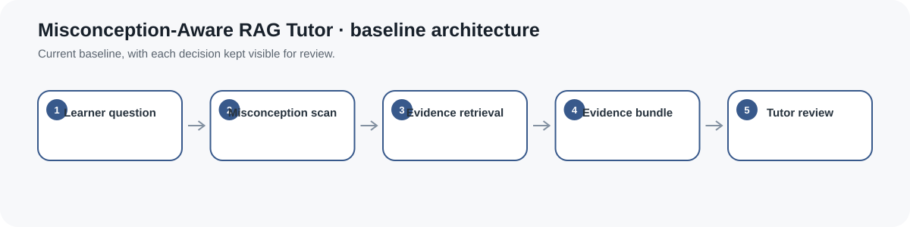
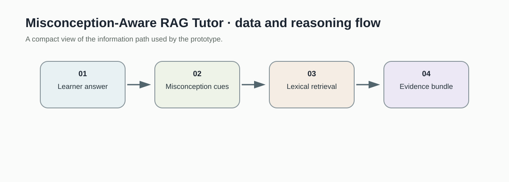
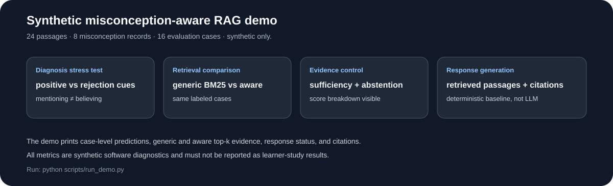
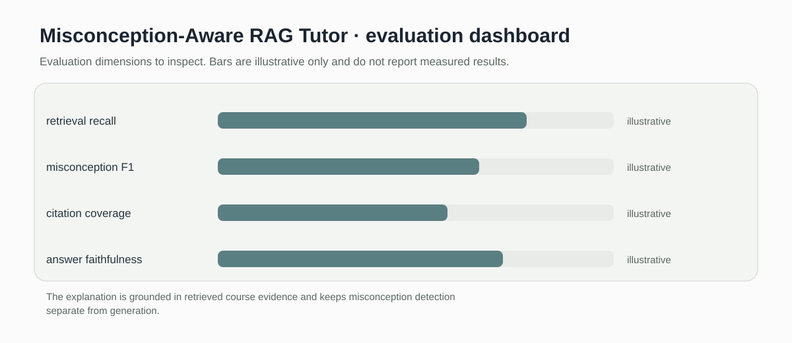

# Misconception-Aware RAG Tutor

> Lexical retrieval baseline that links misconception cues to course evidence without inventing unsupported answers.

[](https://github.com/devissaputra/misconception-aware-rag/actions/workflows/ci.yml)



**Area:** Adaptive Instruction & Feedback    
**Status:** working research prototype  
**Author:** Devis Wawan Saputra

## What this project is for

A tutoring system should retrieve relevant evidence and make possible misconceptions visible to the tutor. This prototype combines simple misconception cue matching with lexical retrieval and returns the IDs of overlapping evidence passages. It does not generate a final tutoring response or apply confidence gating.

**Who may find it useful:** AIED researchers working on grounded tutoring, retrieval-augmented generation, and misconception diagnosis.

## Research questions

1. Does misconception-aware retrieval improve pedagogical relevance compared with generic retrieval?
2. How can explanations remain grounded in approved course evidence?
3. How should uncertainty be surfaced when evidence is insufficient?

## How it works

The current baseline does two inspectable things: it matches configured misconception cues in a learner query and retrieves course passages by normalized lexical overlap. Zero overlap documents are discarded, and the function returns evidence rather than generating an answer.



A learner query is checked for known misconception cues, then relevant course evidence is retrieved and returned as an evidence bundle. Response generation and confidence gating are deliberately outside the current code.



This snapshot shows the bundled synthetic example for Misconception-Aware RAG Tutor. It checks the software path; it is not an empirical performance result.

## Methods in the current baseline

- token overlap retrieval
- normalized lexical scoring
- misconception cue matching
- zero overlap filtering
- evidence ID return

## Data

Includes a small synthetic course corpus and misconception map. No copyrighted textbook chapters are bundled.

`data/README.md` documents the sample schema and the conditions that should be recorded before any real dataset is connected. Restricted or identifiable learner data should stay outside the repository.

## Run the demo

```bash
git clone https://github.com/devissaputra/misconception-aware-rag.git
cd misconception-aware-rag
python scripts/run_demo.py
python -m unittest discover -s tests -v
```

The photosynthesis demo now returns only the passage that overlaps the query instead of padding the result with an unrelated zero overlap document.

## What to evaluate next

The next study should use a labeled set of questions, misconceptions, and source passages. Lexical retrieval can then be compared with embedding and reranking baselines before any answer generation is evaluated.

## Evaluation view



The Misconception-Aware RAG Tutor dashboard is an evaluation checklist rather than a result chart. The bars are illustrative only; the labels show the evidence a real study would need to collect.

## Limits and responsible use

Cue matching and lexical overlap will miss paraphrases and can retrieve text that shares words without answering the question. The module does not verify factual completeness or generate a final tutoring response. See `docs/ethics_and_risks.md` for the broader risk review.

## Repository map

```text
.
├── .github/workflows/ci.yml
├── assets/
│   ├── architecture.svg
│   ├── data_flow.svg
│   ├── demo_snapshot.svg
│   └── evaluation_dashboard.svg
├── data/
│   ├── README.md
│   └── sample.csv
├── docs/
│   ├── ethics_and_risks.md
│   ├── related_work.md
│   └── research_protocol.md
├── reports/model_card.md
├── scripts/run_demo.py
├── src/misconception_aware_rag/core.py
├── tests/test_core.py
├── CITATION.cff
├── LICENSE
├── pyproject.toml
└── README.md
```

## Research path

A credible next version would:

1. build a labeled retrieval set with misconception annotations
2. compare lexical retrieval with embedding and reranking baselines
3. evaluate citation coverage and faithfulness only after adding a response model

## Related work

`docs/related_work.md` points to open projects that are relevant to this problem area. They are context for comparison and study design; this repository does not present their code as its own.

## Citation and license

`CITATION.cff` contains the software citation. The code and original SVG visuals use the MIT License. Any external dataset keeps its own license and usage conditions.
