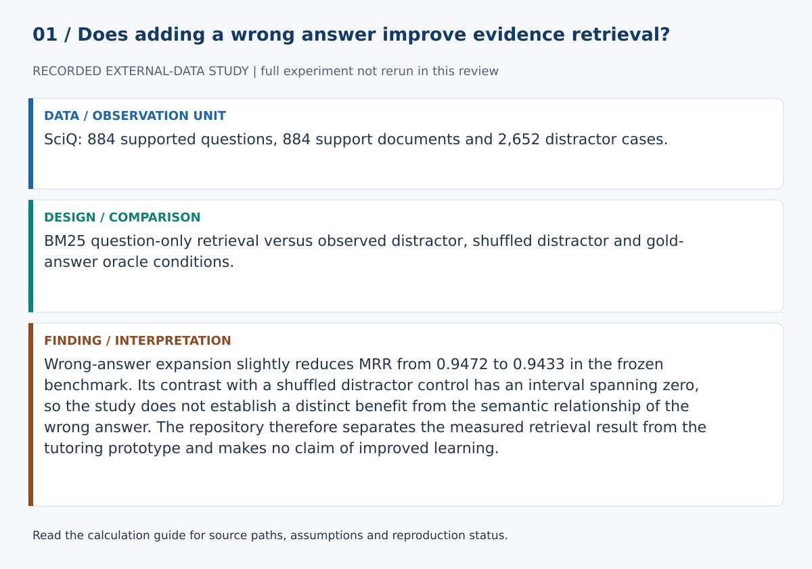
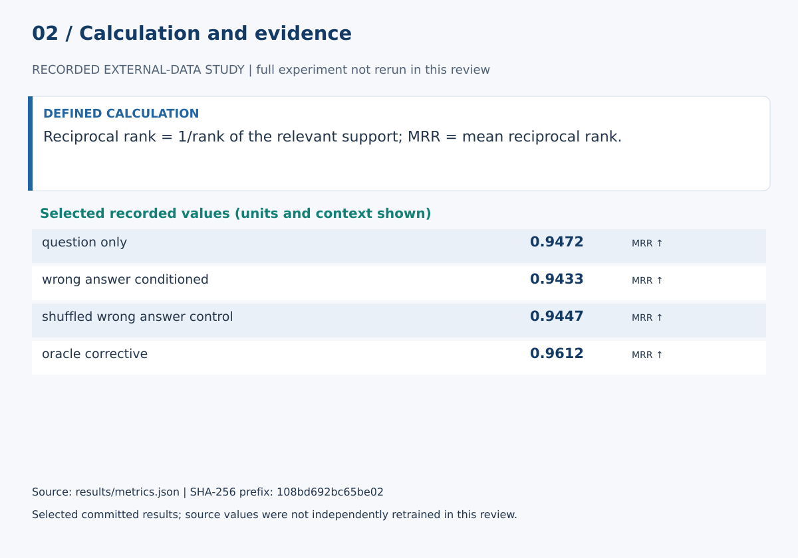

# Does Wrong-Answer Conditioning Change Educational Evidence Retrieval? A Controlled SciQ Study

## Abstract

Misconception-aware retrieval systems often assume that an incorrect response can improve evidence selection, but appending any additional text can also alter lexical retrieval. This study tests a narrower, falsifiable question on the frozen SciQ test split. Question-only BM25 is compared with retrieval conditioned on an observed wrong-answer option, a shuffled wrong-answer negative control that preserves the distractor-text distribution while breaking question–answer alignment, and an oracle-informed gold-answer sensitivity condition. Retrieval quality is measured with rank-based metrics and paired uncertainty is resampled at the question level.

## Research question

Does conditioning a science evidence query on an observed wrong answer change retrieval of the source support passage, and is that change distinguishable from generic distractor-like query expansion?

## Data

The study uses the SciQ test split pinned at revision `2c94ad3e1aafab77146f384e23536f97a4849815`. The runner verifies the exact parquet SHA-256 before analysis. Only questions with non-empty support paragraphs enter the retrieval study.

## Conditions

1. **Question only:** question text.
2. **Observed wrong answer:** question + one SciQ distractor.
3. **Shuffled wrong-answer control:** question + distractor text from a different eligible question using a frozen no-self-match permutation.
4. **Oracle-informed corrective:** question + observed distractor + gold correct answer.

The shuffled condition tests whether effects can be explained by adding distractor-like lexical material. The oracle-informed condition tests how gold answer text changes retrieval but is neither an upper bound nor a deployable method.

## Retrieval and evaluation

The corpus contains unique non-empty SciQ support paragraphs. The relevant document for each question is its associated support paragraph. BM25 uses `k1=1.5`, `b=0.75` and depth five. Metrics are MRR, Recall@1/3/5 and nDCG@5.

Because each question yields three distractor cases, paired uncertainty is bootstrapped by question block. The primary comparison is observed wrong-answer conditioning versus question-only retrieval. Shuffled-vs-question and observed-vs-shuffled contrasts provide negative-control context.

## Generated results

Numerical evidence is generated by `scripts/run_sciq_study.py` into `results/metrics.json`, `results/per_case_metrics.csv`, `results/summary.md`, `paper/results.md` and `paper/results.tex`. The LaTeX manuscript imports generated results directly.

## Empirical interpretation

Observed wrong-answer conditioning lowers MRR relative to question-only retrieval by 0.0039, with a question-block 95% interval of [-0.0077, -0.0002]. The shuffled lexical-expansion control also lowers MRR, by 0.0024 with interval [-0.0044, -0.0005]. The observed-wrong-answer minus shuffled-control contrast is -0.0014 with interval [-0.0057, 0.0027].

The observed-vs-shuffled interval overlaps zero. Under this frozen lexical protocol, the evidence therefore supports a **generic query-expansion cost** more strongly than a distinct effect caused by the semantic relationship of the actual wrong answer. This is a useful negative result: naive wrong-answer concatenation does not provide evidence of misconception-aware retrieval benefit.

## Relationship to the tutoring prototype

The repository also contains a cue-based misconception-hypothesis detector, pedagogical reranker, evidence-sufficiency logic, abstention and deterministic citation-grounded generation. These components remain software research scaffolding. The SciQ experiment validates only the retrieval-conditioning study described above.

## Limitations

SciQ distractors are crowdsourced incorrect options, not learner-produced misconception annotations. BM25 is lexical. The support corpus is not a real course repository. A shuffled lexical control improves interpretation but does not model learner cognition. Retrieval relevance does not establish instructional quality or learning benefit.

## Calculation definitions and evidence audit

Reciprocal rank = 1/rank of the relevant support; MRR = mean reciprocal rank.

Three distractor cases share each question, so uncertainty resamples question blocks. Distractors are proxies, not validated learner misconceptions. Gold-answer expansion has privileged information and is not a deployable method.

Wrong-answer expansion slightly reduces MRR from 0.9472 to 0.9433 in the frozen benchmark. Its contrast with a shuffled distractor control has an interval spanning zero, so the study does not establish a distinct benefit from the semantic relationship of the wrong answer. The repository therefore separates the measured retrieval result from the tutoring prototype and makes no claim of improved learning.

The [calculation guide](../CALCULATIONS.md) provides exact evidence paths and a function-level implementation map.

### Selected evidence and interpretation

| Quantity | Value | Unit / meaning | JSON path |
|---|---:|---|---|
| question_only | 0.9471530920060329 | MRR ↑ | `metrics.question_only.rr` |
| wrong_answer_conditioned | 0.9432629462041229 | MRR ↑ | `metrics.wrong_answer_conditioned.rr` |
| shuffled_wrong_answer_control | 0.9447083961789843 | MRR ↑ | `metrics.shuffled_wrong_answer_control.rr` |
| oracle_corrective | 0.9612242332830566 | MRR ↑ | `metrics.oracle_corrective.rr` |

These values are read from `results/metrics.json`. They must be interpreted with the split, data status and limitations above. The bundled demonstration executed successfully in this review. Stored empirical results were inspected, not independently reproduced from raw data.

### Reproduction and claim boundaries

The existing suite requires unavailable dependencies; no full-suite pass is claimed. The figure generator can be checked with `python scripts/build_review_figures.py --check`. This verifies the displayed calculation evidence, not an independent replication of the complete scientific experiment. The manuscript is a working report, not a peer-reviewed publication.
